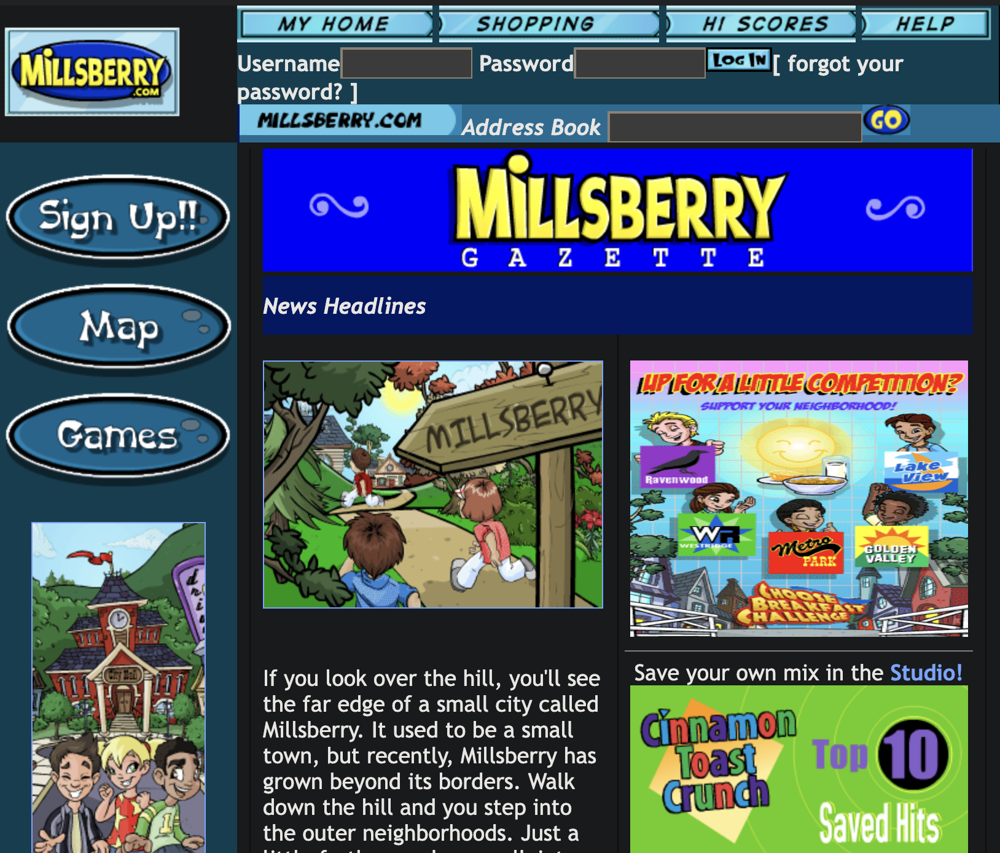

<div align="center">

<b>millsberry.com, rewriten!</b>
</div>
</br>

---

### getting started

**1.** clone this repo
```bash
git clone https://github.com/naestech/millsberry.git
```

</br>

**2.** install dependencies
```
npm install
```
```
yarn install
```

</br>

**3.** start the server
```
npm start
```
```
yarn run start
```

</br>

**4.** head to localhost:3000
<div align="center">

</div>

---
